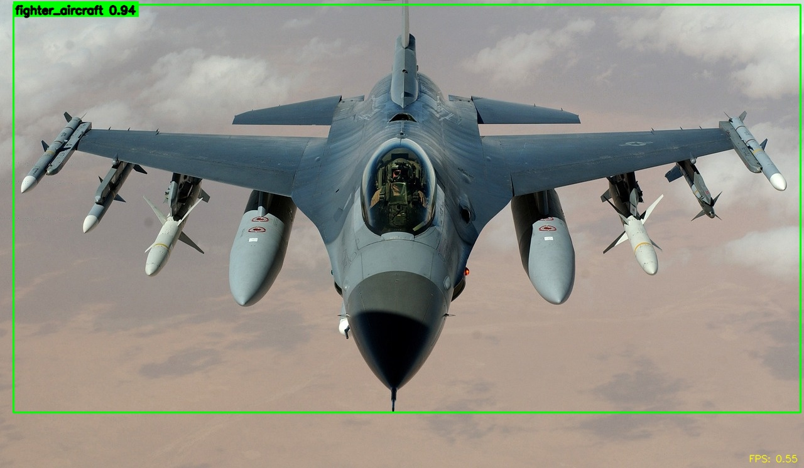
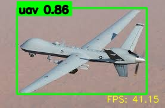
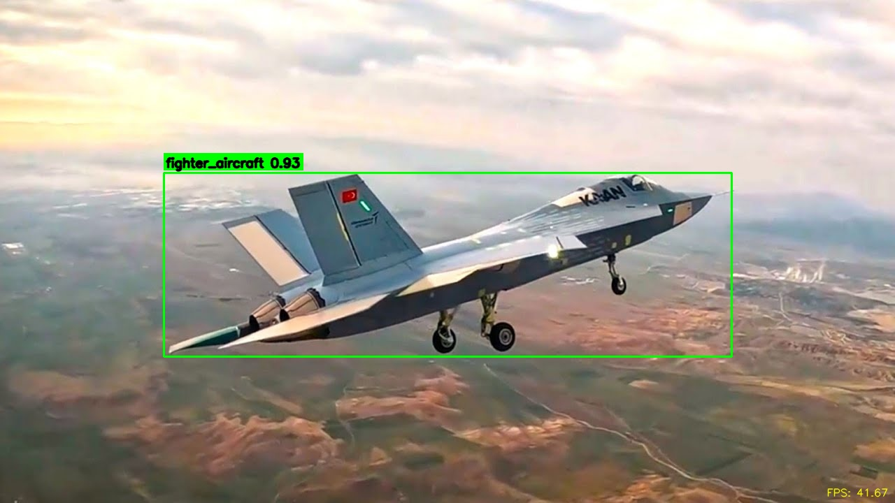
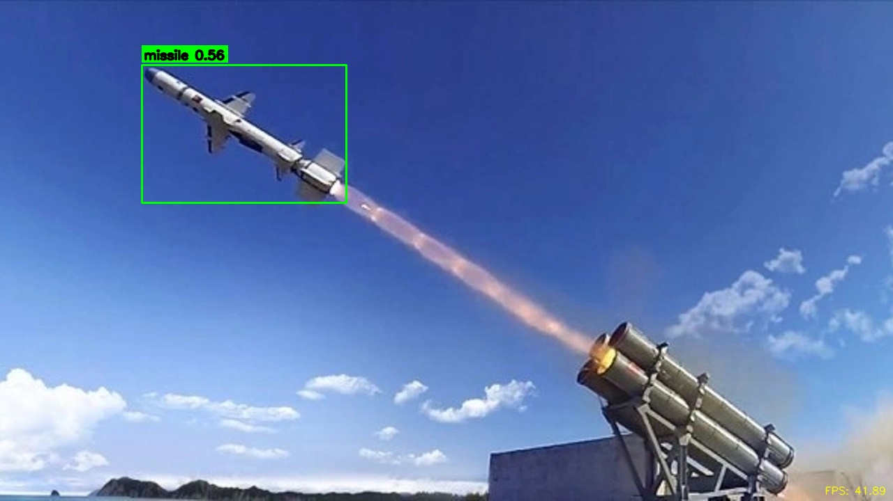
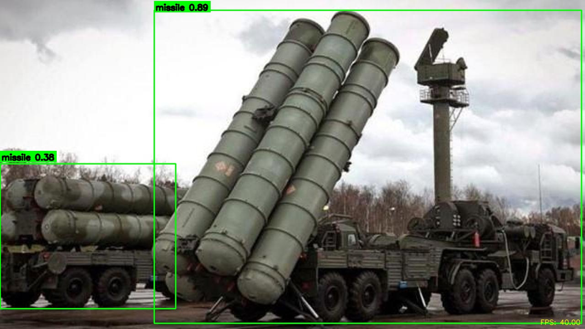

# YOLO11 Air Defense Object Detection Project

## Projenin Amacı

Bu proje, hava savunma alanında kullanılan farklı hava hedeflerini görüntü ve video üzerinde tespit etmek için hazırlanmış bir YOLO11 nesne tespit çalışmasıdır.

Model; tek resim, resim klasörü, video ve canlı kamera görüntüsü üzerinde çalışacak şekilde düzenlenmiştir. Amaç; füze, İHA, helikopter ve savaş uçağı gibi hava hedeflerinin YOLO11 tabanlı bir model ile otomatik olarak algılanmasını sağlamaktır.

## Tespit Edilen Sınıflar

Model dört sınıfı tespit eder:

```text
0: missile
1: uav
2: helicopter
3: fighter_aircraft
```

## Veri Seti Yapısı

Veri seti YOLO formatına uygun şekilde hazırlanmıştır. Görseller ve etiket dosyaları eğitim, doğrulama ve test bölümlerine ayrılmıştır.

Etiket dosyalarında her satır şu formatı kullanır:

```text
class_id x_center y_center width height
```

Koordinat değerleri 0 ile 1 arasında normalize edilmiştir. Sınıf isimleri ve örnek `data.yaml` bilgisi `dataset_info` klasöründe yer alır.

## Eğitim Süreci

Eğitim YOLO11n modeli ile yapılmıştır. Görseller 640 piksel giriş boyutunda kullanılmıştır.

Eğitimde kullanılan temel ayarlar:

```text
Model: YOLO11n
Image Size: 640
Epoch: 20
Learning Rate: 0.001
Batch: Auto
```

CUDA destekli ekran kartı bulunduğunda eğitim ve çıkarım işlemleri GPU üzerinde çalıştırılabilir. CUDA bulunmadığında sistem CPU üzerinden çalışır.

## Kullanılan Model

Çalıştırılacak model dosyası:

```text
model/best.pt
```

Demo kodları varsayılan olarak bu modeli kullanır. Confidence değeri varsayılan olarak `0.40` ayarlanmıştır.

## Sonuçların Yorumlanması

Modelin test sonuçlarında genel mAP@0.5 değeri yaklaşık `0.721`, mAP@0.5:0.95 değeri yaklaşık `0.521` olarak ölçülmüştür.

Missile sınıfında test mAP@0.5 değeri yaklaşık `0.739` olarak elde edilmiştir.

Confusion matrix, PR curve, F1 curve ve eğitim sonuç grafikleri `results` ve `report_assets` klasörlerinde bulunur.

## Demo / Inference Kullanımı

Demo klasörüne girip ana menü çalıştırılır:

```powershell
cd demo
python main.py
```

Menüden aşağıdaki işlemler seçilebilir:

```text
1. Tek resim üzerinde tespit
2. Resim klasörü üzerinde tespit
3. Tek video üzerinde tespit
4. Video klasörü üzerinde tespit
5. Webcam / canlı kamera ile tespit
```

Resim dosyaları şu klasöre eklenir:

```text
demo/test_images
```

Video dosyaları şu klasöre eklenir:

```text
demo/test_videos
```

Tespit çıktıları şu klasörlere kaydedilir:

```text
demo/image_detected
demo/video_detected
```

## Demo Çıktıları

Aşağıda modelin farklı görüntüler üzerinde ürettiği örnek tespit çıktıları yer almaktadır.

| F16 / Fighter Aircraft | İHA / UAV |
| --- | --- |
|  | _detected.jpg>) |

| UAV Örneği | UAV Örneği |
| --- | --- |
| _detected.jpg>) | _detected.jpg>) |

| İHA / UAV | KAAN / Fighter Aircraft |
| --- | --- |
|  |  |

| Füze / Missile | S-400 |
| --- | --- |
|  |  |

## Video Demo

Modelin video üzerindeki örnek tespit çıktısı aşağıdaki bağlantıdan görüntülenebilir:

[Video tespit çıktısını aç](demo/video_detected/test1_detected.mp4)

> Not: GitHub README içinde MP4 dosyaları her zaman doğrudan oynatıcı olarak görünmeyebilir. Bu yüzden video çıktısı bağlantı olarak eklenmiştir.

## Klasör Yapısı

```text
project_root/
├── README.md
├── model/
│   └── best.pt
├── results/
├── demo/
│   ├── main.py
│   ├── test_images/
│   ├── test_videos/
│   ├── image_detected/
│   └── video_detected/
├── dataset_info/
├── report_assets/
└── scripts/
```

## Projeyi Çalıştırmak İçin Gerekenler

Python ortamında gerekli paketler kurulduktan sonra demo çalıştırılabilir.

Örnek kurulum:

```powershell
pip install ultralytics opencv-python
```

Ardından demo klasörüne girilip uygulama başlatılır:

```powershell
cd demo
python main.py
```

## Notlar

- Model dosyası `model/best.pt` yolunda bulunmalıdır.
- CUDA varsa demo kodları GPU kullanır, yoksa CPU ile çalışır.
- Büyük video dosyaları çalışma süresini artırabilir.
- `results` klasörü sayısal ve görsel eğitim sonuçlarını içerir.
- `report_assets` klasörü raporda veya sunumda kullanılabilecek grafik çıktıları içerir.
- Demo çıktıları `demo/image_detected` ve `demo/video_detected` klasörlerine kaydedilir.

## Proje Özeti

Bu çalışma kapsamında YOLO11 tabanlı bir nesne tespit modeli eğitilmiş ve hava savunma senaryosuna uygun şekilde test edilmiştir. Model, görüntü ve video dosyalarında füze, İHA, helikopter ve savaş uçağı sınıflarını tespit edebilmektedir.

Proje; veri seti hazırlama, model eğitimi, test sonuçlarının yorumlanması ve demo uygulaması adımlarını içermektedir.
